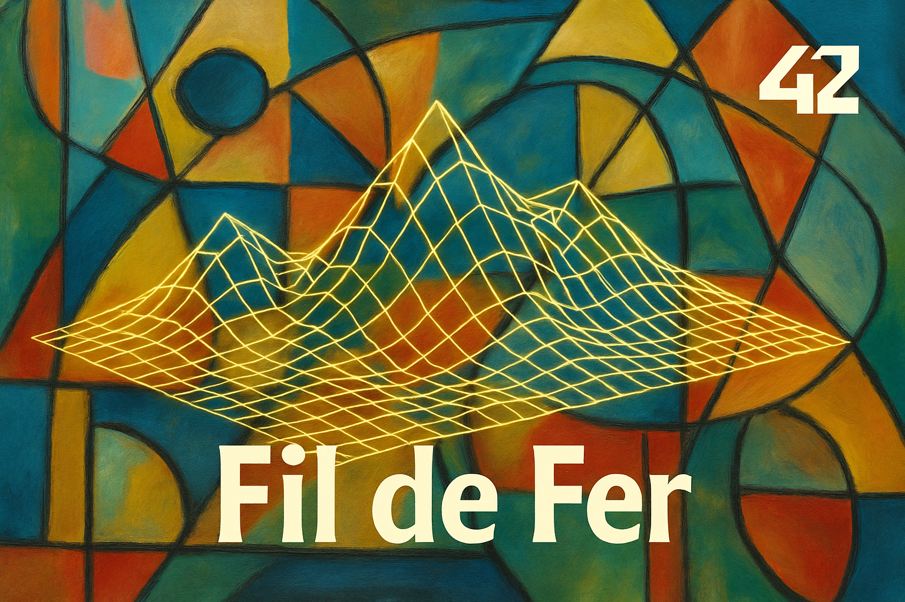
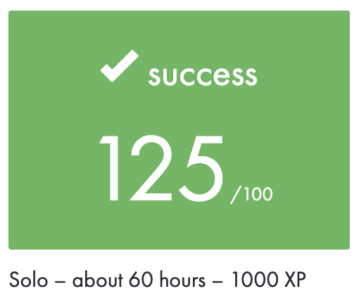
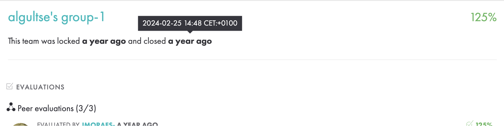
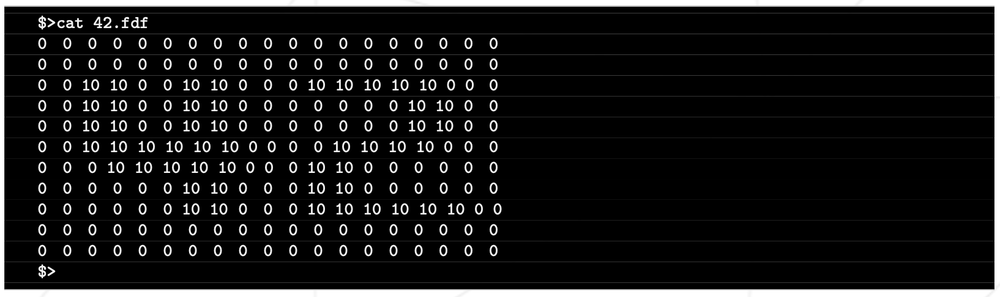
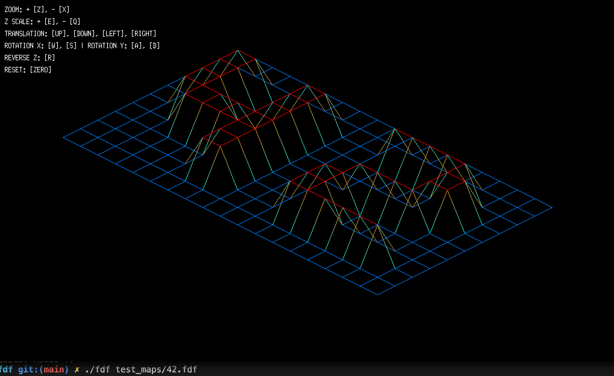
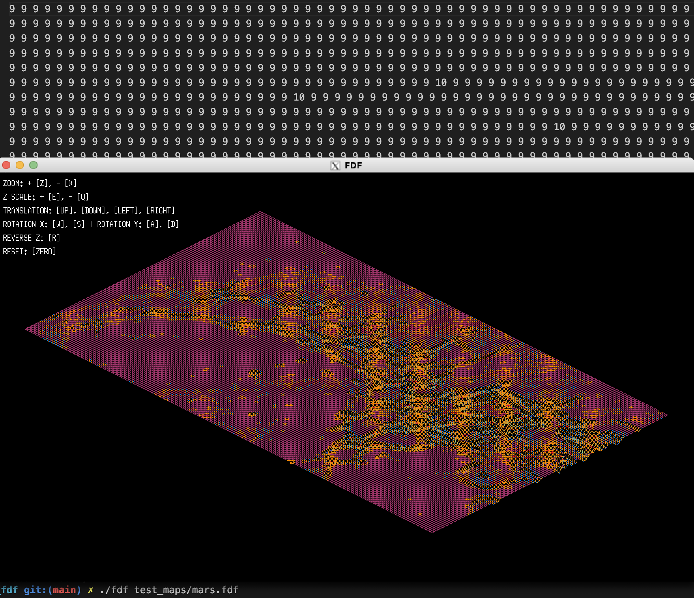
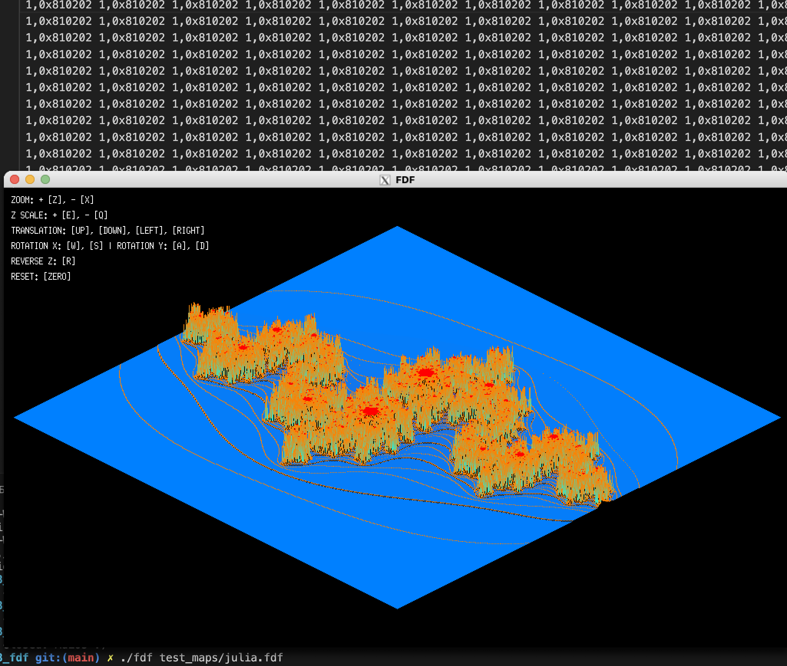

|          Grade           |                           |
|:------------------------:|:-------------------------:|
|  |  |

<br>

---

<details>
<summary>🇫🇷 FRENCH VERSION</summary>

<p align="center">
    Ceci est un <a href="./subject/FDF.fr.subject.pdf">projet graphique</a> de l'école 42 (réalisé en février 2024).
</p>

## Préambule
Le but est de représenter en 3D un paysage à l’aide d’un modèle `Fil de Fer` (wireframe), en utilisant la bibliothèque MiniLibX. Ce projet a permis de découvrir les bases de la programmation graphique : comment représenter des points dans l’espace, les relier entre eux, et les observer selon différents points de vue.

## Compétences:
- Lecture et représentation de `données en 3D`
- Projection isométrique d’un terrain
- Utilisation de `MiniLibX` (gestion d’une fenêtre, rendu d’image, événements clavier/souris)
- Manipulations de points dans l’espace (x, y, z)
- Implémentation du zoom, rotation, translation (bonus)

## Exemple d’entrée :


## Installation & exécution
```bash
git clone https://github.com/N0fish/FDF.git
cd FDF
make
./fdf test_maps/42.fdf
```

### Prereq
- install minilibx
- have x11 server

(Mac only)
```shell
brew install Xquartz
defaults write org.xquartz.X11 enable_test_extensions -boolean true
```

</details>

---

<details>
<summary>🇬🇧 ENGLISH VERSION</summary>

<p align="center">
    This is a <a href="./subject/FDF.en.subject.pdf">graphic project</a> at 42 School (completed in February 2024).
</p>

## Preamble
The goal is to render a 3D landscape using a `Fil de Fer` (wireframe) model, with the help of the MiniLibX graphical library. Learned the fundamentals of graphics programming: how to place points in space, connect them with lines, and render the scene from a chosen viewpoint.

## Skills:
- Reading and rendering `3D data`
- Isometric projection rendering
- Use of `MiniLibX` (window management, image rendering, keyboard/mouse events)
- Manipulating 3D coordinates (x, y, z)
- Implementation of zoom, rotation, and translation (bonus)


## Installation & run
```bash
git clone https://github.com/N0fish/FDF.git
cd FDF
make
./fdf test_maps/42.fdf
```

### Prereq
- install minilibx
- have x11 server

(Mac only)
```shell
brew install Xquartz
defaults write org.xquartz.X11 enable_test_extensions -boolean true
```

</details>

---

<details>
<summary>🇷🇺 RUSSIAN VERSION</summary>

<p align="center">
    Это <a href="./subject/FDF.en.subject.pdf">графический проект</a> в школе 42 (выполнен в феврале 2024 года).
</p>

## Преамбула
Цель — визуализировать ландшафт в 3D в виде каркасной модели `Fil de Fer` (wireframe), используя библиотеку MiniLibX. В процессе изучая основы графического программирования: как отображать точки в пространстве, соединять их отрезками и наблюдать сцену под разными углами.

## Навыки:
- Чтение и отображение `3D-данных`
- Отрисовка изометрической проекции
- Работа с `MiniLibX` (окна, изображения, события клавиатуры/мыши)
- Работа с координатами в пространстве (x, y, z)
- Реализация зума, поворота и перемещения (бонус)

## Установка и запуск
```bash
git clone https://github.com/N0fish/FDF.git
cd FDF
make
./fdf test_maps/42.fdf
```

### Prereq
- install minilibx
- have x11 server

(Mac only)
```shell
brew install Xquartz
defaults write org.xquartz.X11 enable_test_extensions -boolean true
```

</details>

---

<br>

## FDF rendered output

|                             |                              |
|:---------------------------:|:----------------------------:|
|    |     |
|  |  |